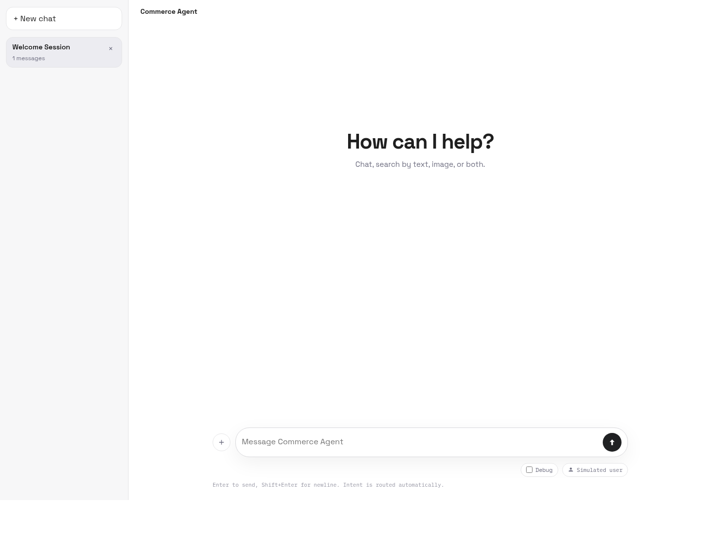
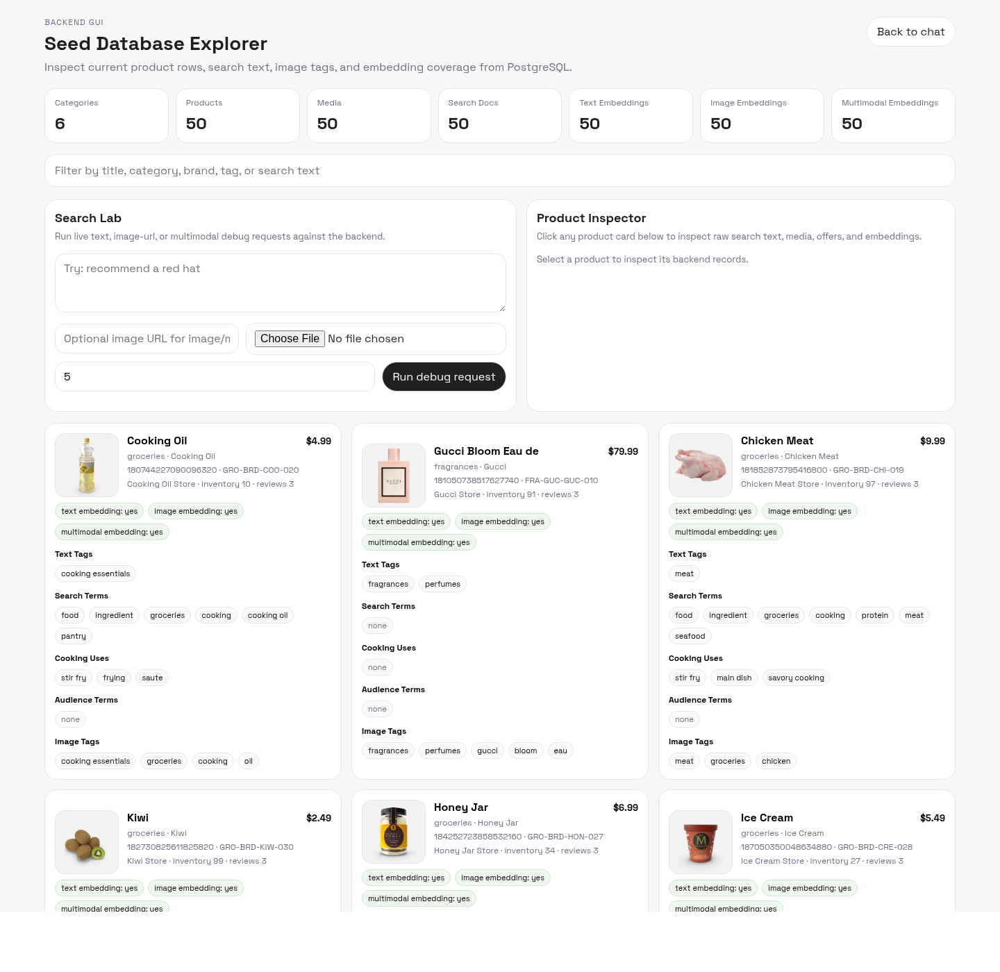
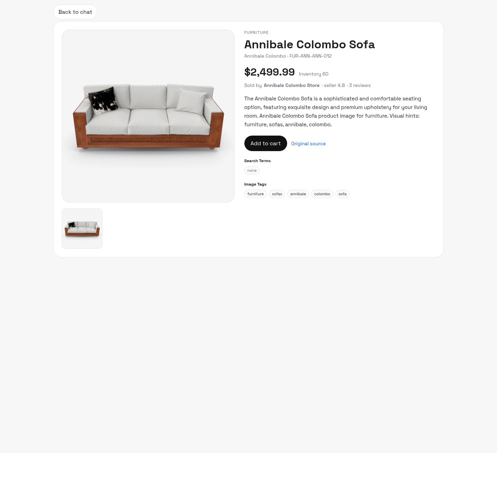
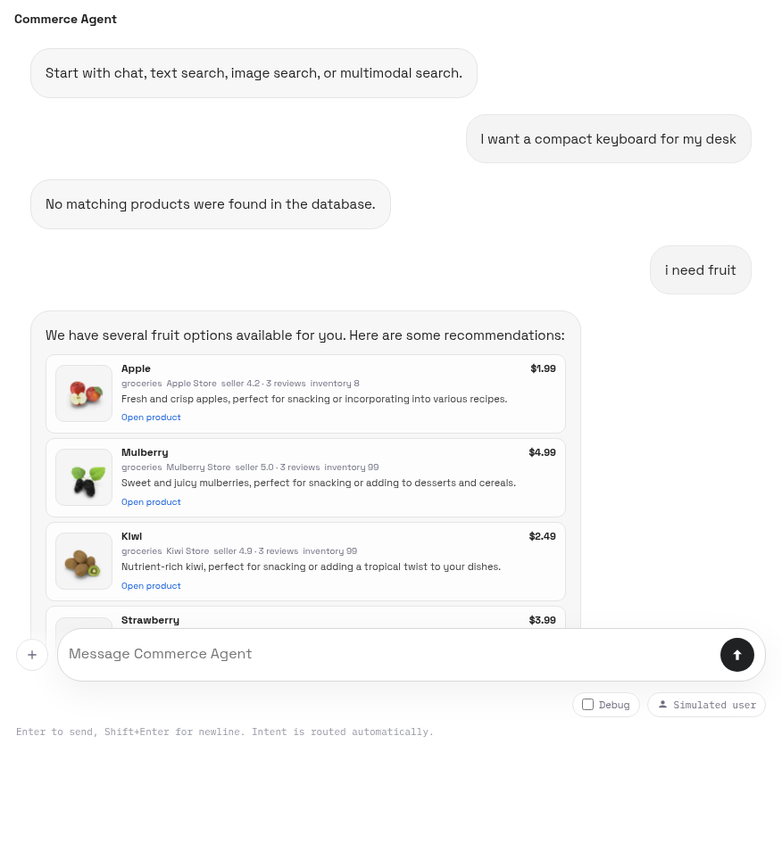

# commerce-agent

`commerce-agent` 是一个本地优先的电商搜索 agent，支持：

- 有边界的 chat
- text product search
- image product search
- multimodal product search
- 基于 LLM 的 intent routing
- PostgreSQL + `pgvector` 检索
- 聊天式前端页面
- 独立的后端 debug GUI
- 电商风格的商品详情页

## 当前状态

截至 **2026-03-25** 的本地验证结果：

- `pytest -q`：**63 passed**
- 本地 PostgreSQL seed：**50 个产品**
- semantic index：
  - `text_embeddings = 50`
  - `image_embeddings = 50`
  - `multimodal_embeddings = 50`

Provider 说明：

- 当前实现不是概念上只能绑定 BigModel
- 这个仓库里当前实际验证跑通的 provider 是 **BigModel**
- 对 router / chat / metadata / vision 这类 model-backed 能力，当前代码期望的是 **OpenAI-compatible API 形态**
- 所以下面的示例会优先写 BigModel 环境变量，因为这是目前仓库里真正验证过的配置

## 页面

主聊天页面：

- `/`
- 单输入框统一支持 chat / text / image / multimodal
- 发送后有 pending 状态
- 可以手动打开 debug

后端 debug GUI：

- `/debug`
- seed 数据浏览
- product inspector
- search lab
- pipeline trace
- routed intent
- top candidates
- 送给 LLM 的 context
- text / image / multimodal 分数拆解

商品详情页：

- `/products/{sku}`
- 用电商页面方式展示单个商品

## 页面截图

主前端页面：



后端 Debug GUI：



商品详情页：



搜索结果示例：



## 核心能力

- 统一消息入口，后端自动决定：
  - `chat`
  - `text-search`
  - `image-search`
  - `multimodal-search`
- search 主路径已经切到 PostgreSQL repository，不再依赖旧的内存 catalog
- 检索使用 3 路 semantic channel：
  - text semantic retrieval
  - image semantic retrieval
  - multimodal semantic retrieval
- 候选先 fusion，再 rerank，最后送给 LLM 做 grounded final answer
- 前端最终只展示 LLM 选中的 products，不直接把原始 top-k 全量摊给用户

## 技术实现路径

当前后端主路径是：

1. 统一请求入口
2. 基于 LLM 的 intent routing
3. 可选的图片理解
4. PostgreSQL 检索
5. 三路 semantic score fusion
6. rerank
7. LLM grounded final answer
8. 前端只渲染 LLM 选中的产品

主要模块：

- routing: [src/commerce_agent/router.py](src/commerce_agent/router.py)
- orchestration: [src/commerce_agent/agent.py](src/commerce_agent/agent.py)
- repository: [src/commerce_agent/repository.py](src/commerce_agent/repository.py)
- embeddings: [src/commerce_agent/embeddings.py](src/commerce_agent/embeddings.py)
- seed pipeline: [src/commerce_agent/seed_data.py](src/commerce_agent/seed_data.py)
- search 最终生成: [src/commerce_agent/search_responder.py](src/commerce_agent/search_responder.py)
- web API: [src/commerce_agent/web.py](src/commerce_agent/web.py)

## 数据获取与清洗

当前本地 seed 方案刻意拆成两层：

1. 公开产品数据源
2. 归一化后的本地 commerce schema

当前 50 条本地 seed 使用的是 `DummyJSON` 公开产品数据。构建 seed 时，系统会：

- 拉取公开产品字段：
  - title
  - description
  - category
  - price
  - rating
  - stock
  - tags
  - brand
  - sku
  - images / thumbnail
  - reviews
- 归一化 category 和 seller code
- 映射进内部表：
  - `products`
  - `product_media`
  - `sellers`
  - `product_offers`
  - `product_review_stats`
  - `product_search_documents`
- 通过统一 id 模块生成稳定 id
- 调用 LLM-backed metadata enrichment 生成更适合检索的 metadata

对应实现：

- 公共数据拉取与标准化: [src/commerce_agent/seed_data.py](src/commerce_agent/seed_data.py)
- id 生成: [src/commerce_agent/ids.py](src/commerce_agent/ids.py)
- 统一写库入口: [src/commerce_agent/db_write.py](src/commerce_agent/db_write.py)

## Metadata Enrichment

当前主方案已经不再依赖那种固定手写的 grocery term map。

现在在 build seed 时，会先做一层 model-backed enrichment：

- 输入：
  - title
  - description
  - category
  - tags
  - brand
- 输出：
  - `search_terms`
  - `cooking_uses`
  - `audience_terms`

这层的目的，是在公开数据源 metadata 比较弱的时候，补出对 retrieval 更友好的结构化信息。

当前实现：

- [src/commerce_agent/seed_data.py](src/commerce_agent/seed_data.py)

fallback 仍然存在，但只是 provider 不可用时的兜底，不再是主路径。

## Retrieval 过程

当前 search 并不是只走一条 retrieval channel。

现在所有搜索路径都走 **三路 semantic retrieval**：

- `text` semantic retrieval
- `image` semantic retrieval
- `multimodal` semantic retrieval

### Text query 路径

对于 text request，后端会：

- 先走轻量 search parser
- 对 text query 做 embedding
- 从同一个 query 文本再派生 image-side reference embedding
- 再派生 multimodal embedding query
- 在 PostgreSQL 的 `product_embeddings` 中同时查询：
  - `embedding_type = 'text'`
  - `embedding_type = 'image'`
  - `embedding_type = 'multimodal'`
- 合并候选并计算 fused score

### Image query 路径

对于 image request，后端会：

- 先做图片理解
- 把 image summary + image tags 转成 query text
- 再构建：
  - text-side semantic vector
  - image-side semantic vector
  - multimodal semantic vector
- 同时查询 3 类 embedding

### Multimodal query 路径

对于 text + image request，后端会：

- 先解析 text query
- 再做图片理解
- 把两边信息合成统一的 multimodal query representation
- 再从 3 类 embedding 中共同召回

这意味着：

- text search 不是“只查 text”
- image search 不是“只查 image”
- multimodal 也不是“只查一条 blended vector”

三种入口都会跨 3 个 semantic space 召回，再做融合。

## Rerank 与 Fusion 细节

repository 当前会先把 3 路 semantic score 融合成一个 fused score。

当前权重是：

- text-search:
  - text: `0.4`
  - image: `0.2`
  - multimodal: `0.4`
- image-search:
  - text: `0.2`
  - image: `0.45`
  - multimodal: `0.35`
- multimodal-search:
  - text: `0.3`
  - image: `0.3`
  - multimodal: `0.4`

之后 agent 会把结果映射成统一的 `ScoredCandidate`，然后做 rerank。当前 rerank 可按这些策略排序：

- `text-score`
- `image-score`
- `multimodal-score`
- `blended-score`

debug GUI 里现在已经可以看到：

- text semantic score
- image semantic score
- multimodal semantic score
- fused score

对应实现：

- SQL 检索与融合: [src/commerce_agent/repository.py](src/commerce_agent/repository.py)
- rerank 层: [src/commerce_agent/agent.py](src/commerce_agent/agent.py)
- debug GUI: [web/debug.html](web/debug.html), [web/assets/debug.js](web/assets/debug.js)

## 最终送给 LLM 的生成过程

当前前端看到的最终答案，不是简单把 top-k 原样展示出来。

实际流程是：

1. retrieval 先得到 top-k 候选
2. rerank 做排序
3. reranked set 送给 search responder
4. LLM 返回：
   - `response`
   - `selected_product_ids`
5. 前端最终只展示 `selected_product_ids` 对应的产品

这样做的原因是：

- retrieval top-k 里可能仍然混入弱相关项
- 这些弱相关项可以保留在 debug 中用于分析
- 但不应该直接展示给最终用户

当前 debug trace 已经能看到：

- `selected_product_ids`
- `prompt_context`
- final answer 之前的 top candidates

对应实现：

- [src/commerce_agent/search_responder.py](src/commerce_agent/search_responder.py)
- [src/commerce_agent/tools.py](src/commerce_agent/tools.py)
- [web/assets/app.js](web/assets/app.js)

## 后续性能优化点

当前实现已经适合本地开发和验证，但后面还有很明确的优化方向。

### 数据与索引

- 把 semantic indexing 从全量重建改成增量构建
- 为：
  - text embedding 输入
  - image embedding 输入
  - multimodal embedding 输入
  增加 source hash
- 把“变更商品重建”和“全量重建”分开

### Retrieval 质量

- 增加 category-aware boost
- 增加显式排除信号：
  - pet food vs human food
  - decor vs furniture vs kitchen
- 在 embedding 前增加更好的多语言 query rewrite
- 把轻量 parser 升级成 model-backed structured query parsing

### Retrieval 效率

- 不再固定用 `limit * 8`，而是按通道单独调 candidate pool
- 针对 `pgvector` HNSW 做更细的 ANN 参数调优
- 对重复 query 做 embedding cache
- build job 中对 embedding 做 batch 化

### Rerank 质量

- 引入专门的 rerank model，而不是只靠 score 排序
- 加入 price / inventory / review 等 business features
- 按 intent 定制不同 rerank template

### LLM final generation

- 给最终回答加 citation-style product reference
- debug 模式保留 raw LLM output
- 对 JSON 输出契约做更严格校验
- 在 evalbench 中增加 grounding 检查

### Debug 与可观测性

- 暴露 retrieval SQL timing
- 暴露每个 channel 的 candidate 数量
- 展示 “selected before validation / selected after validation”
- 在每个 trace 中记录 provider / model version

## 项目文档

- 英文数据库设计: [docs/database-design.md](docs/database-design.md)
- 中文数据库设计: [docs/database-design.zh-CN.md](docs/database-design.zh-CN.md)
- Seed 数据方案: [docs/seed-data-plan.md](docs/seed-data-plan.md)
- 英文说明: [README.md](README.md)
- 数据库工作区: [db/README.md](db/README.md)

## 本地安装

### 方式 A：直接用 `pyproject.toml`

```bash
python3 -m pip install -e .
```

### 方式 B：先用 `requirements.txt`

```bash
python3 -m pip install -r requirements.txt
python3 -m pip install -e .
```

### 环境变量

先复制模板：

```bash
cp .env.example .env
```

常见本地 key：

- `BIGMODEL_API_KEY`
- `COMMERCE_AGENT_VISION_API_KEY`
- `OPENAI_API_KEY`

这里要特别说明：

- 当前代码路径实际测试用的是 **BigModel**
- 运行时模型和 provider 配置是集中管理、可替换的
- 如果你要替换 provider，最关键的是它要兼容当前代码预期的 OpenAI-style chat / embedding 接口
- 也就是说：README 里写 BigModel，是因为它已经被验证，不代表架构只能用 BigModel

统一配置入口在：

- [src/commerce_agent/config.py](src/commerce_agent/config.py)

## 数据库部署

启动 PostgreSQL：

```bash
docker compose up -d postgres
```

执行 migration：

```bash
docker compose exec -T postgres psql \
  -U commerce_agent \
  -d commerce_agent \
  -f /work/db/migrations/0001_initial_schema.sql

docker compose exec -T postgres psql \
  -U commerce_agent \
  -d commerce_agent \
  -f /work/db/migrations/0002_embedding_dimension_1024.sql
```

## Seed 和索引构建

构建并导入 50 条公开产品 seed：

```bash
commerce-agent-build-public-seed
commerce-agent-load-seed --seed-path db/seeds/public_seed_50.json --truncate-first
```

构建 semantic index：

```bash
commerce-agent-build-semantic-indexes
commerce-agent-semantic-index-status
```

如果只想单独构建某一类：

```bash
commerce-agent-build-text-embeddings
commerce-agent-build-image-embeddings
commerce-agent-build-multimodal-embeddings
```

这些 CLI 命令本身是 provider-agnostic 的；但当前仓库里已经验证通过的 embedding 配置是 BigModel。

## 运行方式

CLI 示例：

```bash
commerce-agent chat "What kinds of search do you support?"
commerce-agent text-search "running shoes"
commerce-agent image-search ./example.jpg
commerce-agent multimodal-search --text "office chair" --image ./example.jpg
```

启动 Web：

```bash
commerce-agent-web
```

如果 `8000` 被占用：

```bash
COMMERCE_AGENT_PORT=8010 commerce-agent-web
```

然后打开：

- `http://127.0.0.1:8010/`
- `http://127.0.0.1:8010/debug`

## Docker 本地部署流程

当前仓库已经内置了本地开发用的 Docker PostgreSQL：

```bash
docker compose up -d postgres
```

典型的本地完整流程：

```bash
docker compose up -d postgres
docker compose exec -T postgres psql -U commerce_agent -d commerce_agent -f /work/db/migrations/0001_initial_schema.sql
docker compose exec -T postgres psql -U commerce_agent -d commerce_agent -f /work/db/migrations/0002_embedding_dimension_1024.sql
commerce-agent-build-public-seed
commerce-agent-load-seed --seed-path db/seeds/public_seed_50.json --truncate-first
commerce-agent-build-semantic-indexes
COMMERCE_AGENT_PORT=8010 commerce-agent-web
```

## 测试命令

完整测试：

```bash
pytest -q
```

针对性测试：

```bash
pytest -q tests/test_web.py
pytest -q tests/test_agent.py
```

运行 eval bench：

```bash
python -m devtools.evalbench.runner --suite all
```

## 特色 Debug 页面

这个项目很重要的一块就是后端 debug GUI。

它可以直接看到：

- seed 数据库表统计
- PostgreSQL 中的产品数据
- text tags
- image tags
- search terms
- cooking-use metadata
- embedding 覆盖情况
- 单个 product 的完整 inspector
- search lab 实时回放请求
- intent routing 结果
- top candidates
- rerank 后结果
- 最终送给 LLM 的 context

## Provider 配置说明

当前仓库里，下面这些 model-backed 路径已经用 **BigModel** 验证过：

- intent router
- metadata enrichment
- search final answer generation
- vision understanding
- embeddings

但这并不意味着产品设计必须绑定 BigModel。

真正重要的是：

- provider 配置统一收口在 [src/commerce_agent/config.py](src/commerce_agent/config.py)
- 各个 model-backed 模块通过环境变量选择 provider
- 替换 provider 时，需要满足当前代码依赖的 API 契约

所以 README 中优先展示 BigModel，只是因为它是当前仓库已经跑通并验证过的实现。

## 说明

- 商品详情链接现在优先用 `sku`，不再依赖容易变化的内部数值 id
- 最终搜索回答由 LLM 生成，但严格限定在数据库召回的产品范围内
- debug 里仍然能看到弱相关 top-k；但最终前端卡片会按 LLM 选中的 `product ids` 过滤
