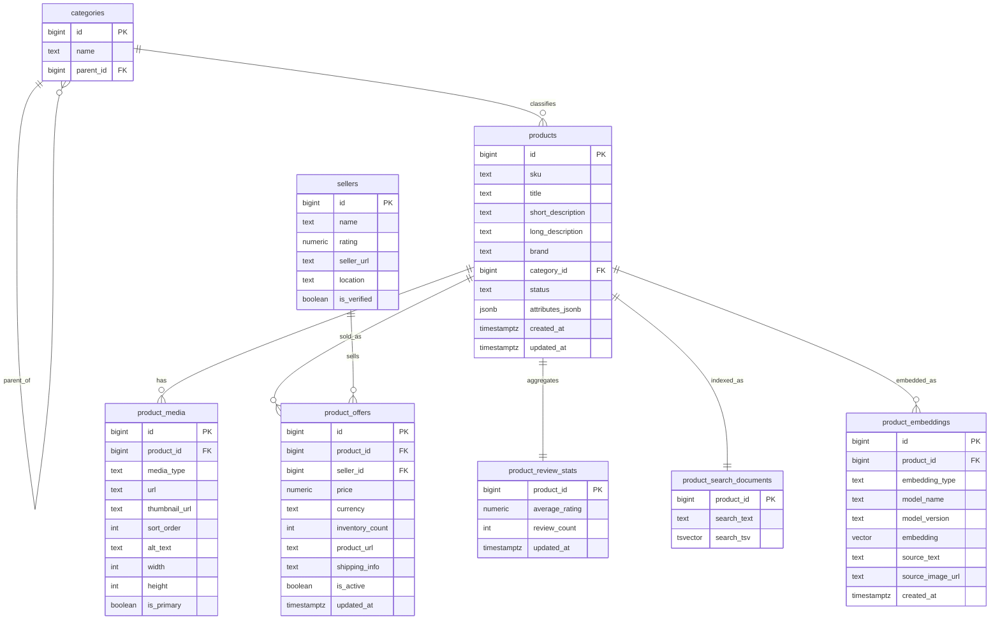

# Database Design

> Maintenance note:
> This file and `docs/database-design.zh-CN.md` must be updated together.
> Keep section order, ER structure, and table definitions aligned across both versions.

This document fixes the proposed product database design for future implementation.
It covers:

- the core tables
- how they relate to each other
- what each table is for
- how keyword, semantic, and image search will join back to product data
- the likely scale path from local development to production

## Design Goals

The database needs to support:

- keyword search
- semantic text search
- image search
- hybrid multimodal retrieval
- product result cards with image, title, price, seller, review count, inventory, and product URL
- local development and testing on one machine

The recommended first production-like stack is:

- PostgreSQL
- PostgreSQL Full-Text Search
- `pgvector`

## Entity Relationship Diagram



## Table Purposes

### `categories`

Purpose:
- hold the normalized category tree
- support browse filters and category boosts
- avoid duplicated free-text category strings in `products`

Main fields:
- `id`
- `name`
- `parent_id`

Example:
- `Bags` -> `Crossbody Bags`

### `products`

Purpose:
- store the core product identity and descriptive data
- act as the main entity referenced by search and offer tables

Main fields:
- `title`
- `short_description`
- `long_description`
- `brand`
- `category_id`
- `attributes_jsonb`

### `product_media`

Purpose:
- store product image metadata and display URLs
- provide the image shown in search results

Main fields:
- `url`
- `thumbnail_url`
- `is_primary`

### `sellers`

Purpose:
- store seller-level metadata separately from product metadata
- support multiple sellers for the same product later

Main fields:
- `name`
- `rating`
- `seller_url`
- `is_verified`

### `product_offers`

Purpose:
- store offer-level facts that change often
- separate price, inventory, and detail URLs from the product core

Main fields:
- `price`
- `currency`
- `inventory_count`
- `product_url`
- `seller_id`

### `product_review_stats`

Purpose:
- store review aggregates used in result cards
- avoid loading raw reviews for every search result

Main fields:
- `average_rating`
- `review_count`

### `product_search_documents`

Purpose:
- store the search-optimized text representation of a product
- support PostgreSQL full-text search without rebuilding the text at query time

Main fields:
- `search_text`
- `search_tsv`

Typical `search_text` source:
- product title
- short description
- brand
- category name
- selected attributes
- seller name

This can be a physical table or a materialized view.

### `product_embeddings`

Purpose:
- store semantic vectors for text and image retrieval
- support `pgvector` similarity search

Main fields:
- `embedding_type`
- `embedding`
- `model_name`
- `source_text`
- `source_image_url`

Suggested embedding types:
- `text`
- `image`
- `multimodal`

## Common Join Paths

### 1. Search result card assembly

This is the standard join path for showing one product card in search results.

```text
search hit
-> products
-> product_media (primary image)
-> product_offers (active offer)
-> sellers
-> product_review_stats
-> categories
```

Typical output fields:
- product title
- short description
- primary image URL
- price
- currency
- seller name
- seller rating
- review count
- inventory count
- product URL
- category name

### 2. Keyword search join path

```text
product_search_documents
-> products
-> product_media
-> product_offers
-> sellers
-> product_review_stats
```

Notes:
- filter with `search_tsv @@ tsquery`
- sort with `ts_rank(...)`
- then join the product card tables

### 3. Semantic text search join path

```text
product_embeddings (embedding_type = 'text')
-> products
-> product_media
-> product_offers
-> sellers
-> product_review_stats
```

Notes:
- query with vector distance
- usually take top-k candidate `product_id`s first
- then join the presentation tables

### 4. Image search join path

```text
product_embeddings (embedding_type = 'image')
-> products
-> product_media
-> product_offers
-> sellers
-> product_review_stats
```

Notes:
- uploaded image is converted into an image embedding
- nearest-neighbor search returns candidate products
- result card joins are the same as text search

### 5. Multimodal search join path

```text
keyword hits from product_search_documents
+ vector hits from product_embeddings
-> fused candidate list
-> products
-> product_media
-> product_offers
-> sellers
-> product_review_stats
```

Notes:
- application layer combines keyword score, text semantic score, and image score
- final rerank happens before card assembly

## Recommended Read Model

For frontend responses, use a joined read model like:

```text
product_id
title
primary_image_url
price
currency
short_description
seller_name
seller_rating
review_count
inventory_count
product_url
category_name
match_type
match_score
```

This should be produced by the backend, not assembled in the frontend.

## Local Development Shape

Phase 1 local stack:

- PostgreSQL 16
- `pgvector`
- local files or MinIO for images

Why:
- one-machine setup
- easy schema iteration
- easy traceability
- supports keyword + vector retrieval in one database

## Scale Path

### Phase 1

Use:
- PostgreSQL
- Full-Text Search
- `pgvector`

Best for:
- local development
- early production
- moderate catalog size

### Phase 2

Add:
- OpenSearch for heavier keyword/facet retrieval

Keep:
- PostgreSQL as source of truth
- product relational model unchanged

### Phase 3

Add:
- dedicated vector infrastructure such as Qdrant or Milvus

Keep:
- PostgreSQL for business data
- the same product and offer tables
- the same read model contract to the frontend

## Implementation Note

The current repository still uses a JSON catalog for the MVP.
This document defines the target database shape for the next implementation stage.
