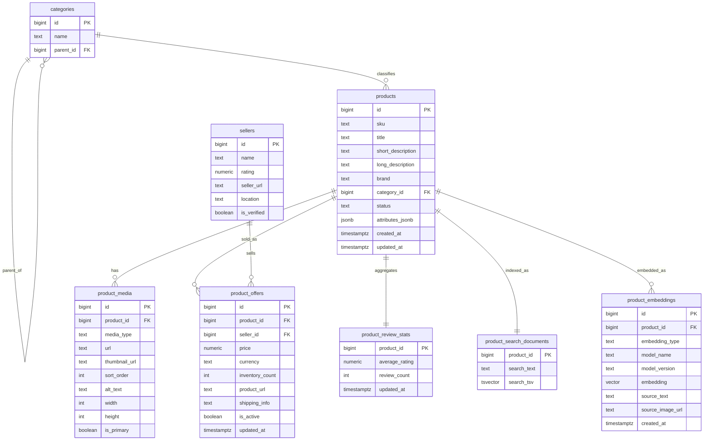

# 数据库设计

> 维护约定：
> 本文件与 `docs/database-design.md` 必须同步维护。
> 两个版本的章节顺序、ER 结构和表定义需要保持一致。

本文档用于固化后续产品数据库设计，供实现阶段直接参考。
内容包括：

- 核心表设计
- 表之间的关系
- 每张表的用途
- keyword、semantic、image search 如何回连到产品信息
- 从本地开发到后续扩容的演进路径

## 设计目标

数据库需要支持：

- keyword search
- semantic text search
- image search
- hybrid multimodal retrieval
- 搜索结果卡片需要返回图片、标题、价格、seller、review 数量、inventory 数量、产品 URL
- 支持单机本地开发和测试

推荐的一期生产化选型：

- PostgreSQL
- PostgreSQL Full-Text Search
- `pgvector`

## ID 策略

关系模型中的主键统一采用 Snowflake-style `bigint`。

原则：

- 不使用数据库自增 id 作为长期实体主键
- `products`、`categories`、`sellers`、`product_media`、`product_offers`、`product_embeddings` 统一使用有时间序的 64 位整数 id
- 面向业务展示的标识单独保留，例如 `sku`、`seller_code`、`category_slug`

原因：

- 更适合后续分布式写入和服务拆分
- 相比 UUID 更紧凑
- 比随机 id 更有利于索引局部性
- 避免暴露数据库自增序列带来的规模信息

在本仓库中，MVP 的 JSON catalog 也应使用 Snowflake-style 整数产品 id，保证应用层模型和目标数据库设计保持一致。

## ER 图



## 各表用途

### `categories`

用途：
- 保存标准化的类目树
- 支持类目筛选和类目加权
- 避免在 `products` 中重复保存不规范的 category 字符串

主要字段：
- `id`
- `name`
- `parent_id`

示例：
- `Bags` -> `Crossbody Bags`

### `products`

用途：
- 存放产品主体信息和描述信息
- 作为搜索层和 offer 层回连的主实体

主要字段：
- `title`
- `short_description`
- `long_description`
- `brand`
- `category_id`
- `attributes_jsonb`

### `product_media`

用途：
- 存放产品图片元数据和展示 URL
- 给搜索结果卡片提供主图

主要字段：
- `url`
- `thumbnail_url`
- `is_primary`

### `sellers`

用途：
- 将 seller 维度信息和 product 主体信息拆开
- 为后续“一商品多 seller”预留结构

主要字段：
- `name`
- `rating`
- `seller_url`
- `is_verified`

### `product_offers`

用途：
- 存放变化更频繁的 offer 级信息
- 将价格、库存、详情页 URL 从产品主体中拆开

主要字段：
- `price`
- `currency`
- `inventory_count`
- `product_url`
- `seller_id`

### `product_review_stats`

用途：
- 存放结果卡片需要的 review 聚合信息
- 避免每次搜索都回表加载完整 review 明细

主要字段：
- `average_rating`
- `review_count`

### `product_search_documents`

用途：
- 存放为搜索优化后的产品文本表示
- 支持 PostgreSQL full-text search，而不是每次查询时临时拼接文本

主要字段：
- `search_text`
- `search_tsv`

`search_text` 的典型来源：
- product title
- short description
- brand
- category name
- selected attributes
- seller name

这层可以做成物理表，也可以做成 materialized view。

### `product_embeddings`

用途：
- 存放 text 和 image 检索使用的向量
- 支持 `pgvector` similarity search

主要字段：
- `embedding_type`
- `embedding`
- `model_name`
- `source_text`
- `source_image_url`

建议 embedding 类型：
- `text`
- `image`
- `multimodal`

## 常见 Join 路径

### 1. 搜索结果卡片拼装

这是搜索结果中展示一个产品卡片时最常见的 join 路径。

```text
search hit
-> products
-> product_media (primary image)
-> product_offers (active offer)
-> sellers
-> product_review_stats
-> categories
```

典型输出字段：
- product title
- short description
- primary image URL
- price
- currency
- seller name
- seller rating
- review count
- inventory count
- product URL
- category name

### 2. Keyword Search 的 join 路径

```text
product_search_documents
-> products
-> product_media
-> product_offers
-> sellers
-> product_review_stats
```

说明：
- 用 `search_tsv @@ tsquery` 做过滤
- 用 `ts_rank(...)` 排序
- 再 join 到结果卡片需要的表

### 3. Semantic Text Search 的 join 路径

```text
product_embeddings (embedding_type = 'text')
-> products
-> product_media
-> product_offers
-> sellers
-> product_review_stats
```

说明：
- 通过向量距离做检索
- 先取 top-k `product_id`
- 再 join 到展示层数据

### 4. Image Search 的 join 路径

```text
product_embeddings (embedding_type = 'image')
-> products
-> product_media
-> product_offers
-> sellers
-> product_review_stats
```

说明：
- 上传图片先转成 image embedding
- 近邻检索得到候选产品
- 结果卡片 join 路径与 text search 一致

### 5. Multimodal Search 的 join 路径

```text
keyword hits from product_search_documents
+ vector hits from product_embeddings
-> fused candidate list
-> products
-> product_media
-> product_offers
-> sellers
-> product_review_stats
```

说明：
- 应用层融合 keyword score、text semantic score、image score
- 结果卡片拼装前再做最终 rerank

## 推荐的 Read Model

前端结果卡片建议由后端直接返回统一的 read model，不要在前端自行拼接。

```text
product_id
title
primary_image_url
price
currency
short_description
seller_name
seller_rating
review_count
inventory_count
product_url
category_name
match_type
match_score
```

## 本地开发形态

Phase 1 本地开发建议：

- PostgreSQL 16
- `pgvector`
- 本地文件或 MinIO 存图片

原因：
- 单机即可跑通
- schema 迭代方便
- trace 和调试最直接
- 在一个数据库里就能同时支持 keyword 和 vector retrieval

## 后续扩容路径

### Phase 1

使用：
- PostgreSQL
- Full-Text Search
- `pgvector`

适合：
- 本地开发
- 早期生产
- 中等规模 catalog

### Phase 2

新增：
- OpenSearch 负责更重的 keyword / facet retrieval

保留：
- PostgreSQL 作为 source of truth
- product relational schema 不变

### Phase 3

新增：
- 专用向量基础设施，如 Qdrant 或 Milvus

保留：
- PostgreSQL 管业务数据
- 原有 product 和 offer 表结构
- 对前端的 read model contract 保持不变

## 实施说明

当前仓库仍然使用 JSON catalog 作为 MVP 数据源。
本文档定义的是下一阶段数据库实现的目标结构。
